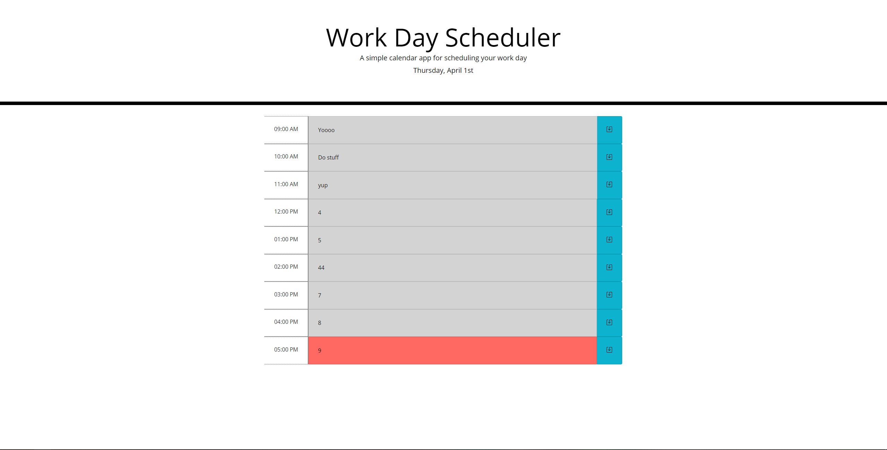

# API_Workday_Scheduler-
INTRODUCTION
------------
This is a Work Day Planner that changes colors depending on the time. If its grey, it means that time has already passed, if its red, thats the current hour, and if its green, that means its in the future.

## Usage:
Insert whatever task you have to do in the correct hour slot and click the save button on the right side to save it.

## Link to deployed project:
https://saebr.github.io/API_Workday_Scheduler/

## Screenshot of site:

